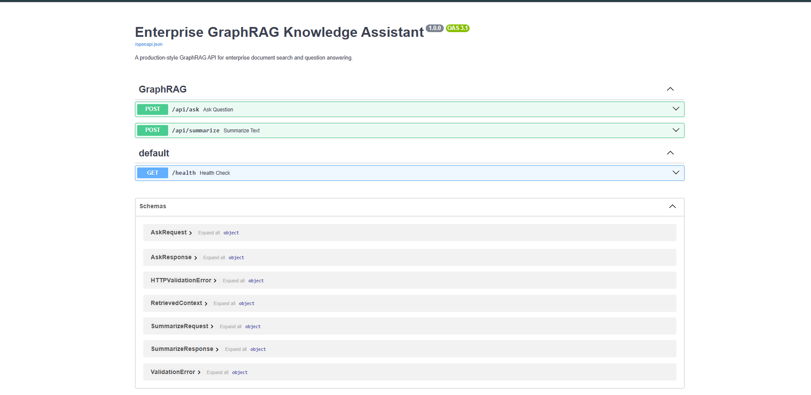

# Enterprise GraphRAG Knowledge Assistant

A production-style GraphRAG knowledge assistant that combines vector search, knowledge graphs, and LLM workflows to support enterprise document search, question answering, summarization, and knowledge discovery.

This project is designed as a portfolio-ready AI engineering project that demonstrates skills in:

- Retrieval-Augmented Generation (RAG)
- GraphRAG and knowledge graphs
- LangGraph-style workflow orchestration
- FastAPI-based AI services
- Document ingestion and chunking
- Hybrid retrieval using vector search and graph traversal
- Production-oriented project structure

---

## Problem

Enterprise users often spend significant time searching across large document collections. Traditional keyword search can miss relevant context, while vector-only RAG can struggle with multi-hop questions and relationship-heavy data.

For example, users may ask questions where the answer depends on relationships between policies, departments, documents, entities, or historical records. A simple semantic search may retrieve relevant chunks, but it may not explain how the information is connected.

---

## Solution

This project implements a GraphRAG-style architecture that combines:

1. Document ingestion
2. Text chunking
3. Embedding generation
4. Vector search
5. Knowledge graph traversal
6. LLM-powered answer generation
7. FastAPI endpoints for search and question answering

The goal is to produce answers that are more contextual, explainable, and grounded in retrieved enterprise knowledge.

---

## Architecture

```text
Enterprise Documents
        |
        v
Document Loader
        |
        v
Chunking + Metadata Extraction
        |
        v
Embedding Generation
        |
        +-----------------------+
        |                       |
        v                       v
Vector Store             Knowledge Graph
        |                       |
        +----------+------------+
                   |
                   v
           Hybrid Retriever
                   |
                   v
          GraphRAG Workflow
                   |
                   v
              LLM Response
                   |
                   v
             FastAPI Service
```

---
## Demo

The FastAPI backend exposes interactive Swagger documentation for testing GraphRAG endpoints.


## Tech Stack

| Category | Tools |
|---|---|
| Language | Python |
| API | FastAPI, Uvicorn |
| RAG / Orchestration | LangChain-style services, LangGraph-style workflow design |
| LLMs | GPT-4o / AWS Bedrock / Gemini / Llama compatible design |
| Vector Search | Pinecone / FAISS compatible placeholder |
| Knowledge Graph | Neo4j compatible placeholder |
| Deployment | Docker-ready structure |
| Testing | Pytest |

---

## Project Structure

```text
enterprise-graphrag-knowledge-assistant/
├── app/
│   ├── api/
│   │   └── routes.py
│   ├── core/
│   │   └── config.py
│   ├── services/
│   │   ├── chunker.py
│   │   ├── document_loader.py
│   │   ├── graph_store.py
│   │   ├── llm_service.py
│   │   ├── retriever.py
│   │   └── vector_store.py
│   ├── main.py
│   └── schemas.py
├── data/
│   └── sample_documents/
├── docs/
│   └── architecture.md
├── tests/
│   └── test_health.py
├── .env.example
├── .gitignore
├── Dockerfile
├── LICENSE
├── README.md
└── requirements.txt
```

---

## Features

- Document ingestion pipeline
- Text chunking and metadata extraction
- Embedding/vector-search-ready design
- Knowledge graph storage placeholder
- Hybrid retrieval pipeline
- Question answering endpoint
- Summarization endpoint
- FastAPI backend
- Docker-ready setup
- Clean project structure suitable for production extension

---

## API Endpoints

### Health Check

```http
GET /health
```

### Ask a Question

```http
POST /api/ask
```

Example request:

```json
{
  "question": "What documents discuss compliance requirements?",
  "top_k": 5
}
```

### Summarize Text

```http
POST /api/summarize
```

Example request:

```json
{
  "text": "Paste long enterprise document text here."
}
```

---

## Getting Started

### 1. Clone the repository

```bash
git clone https://github.com/<your-username>/enterprise-graphrag-knowledge-assistant.git
cd enterprise-graphrag-knowledge-assistant
```

### 2. Create a virtual environment

```bash
python -m venv venv
```

Activate it:

```bash
# Mac/Linux
source venv/bin/activate

# Windows
venv\Scripts\activate
```

### 3. Install dependencies

```bash
pip install -r requirements.txt
```

### 4. Create environment file

```bash
cp .env.example .env
```

Add your API keys if needed.

### 5. Run the FastAPI app

```bash
uvicorn app.main:app --reload
```

Open:

```text
http://127.0.0.1:8000/docs
```

---

## Example Use Cases

- Enterprise document search
- Policy search
- Compliance question answering
- Knowledge discovery across documents
- Document summarization
- Internal support assistant
- Multi-hop question answering over enterprise knowledge

---

## Future Enhancements

- Integrate Pinecone or FAISS for production vector search
- Integrate Neo4j for real knowledge graph traversal
- Add LangGraph workflow implementation
- Add authentication and role-based access control
- Add RAG evaluation metrics
- Add hallucination and citation evaluation
- Add frontend dashboard
- Add deployment to AWS or Azure
- Add CI/CD pipeline with GitHub Actions

---

## Author

**Rohith Reddy Chinthala**  
Big Data Engineer and AI/ML Engineer  
LinkedIn: https://www.linkedin.com/in/rohitreddy23/  
GitHub: https://github.com/Rohitreddy23
